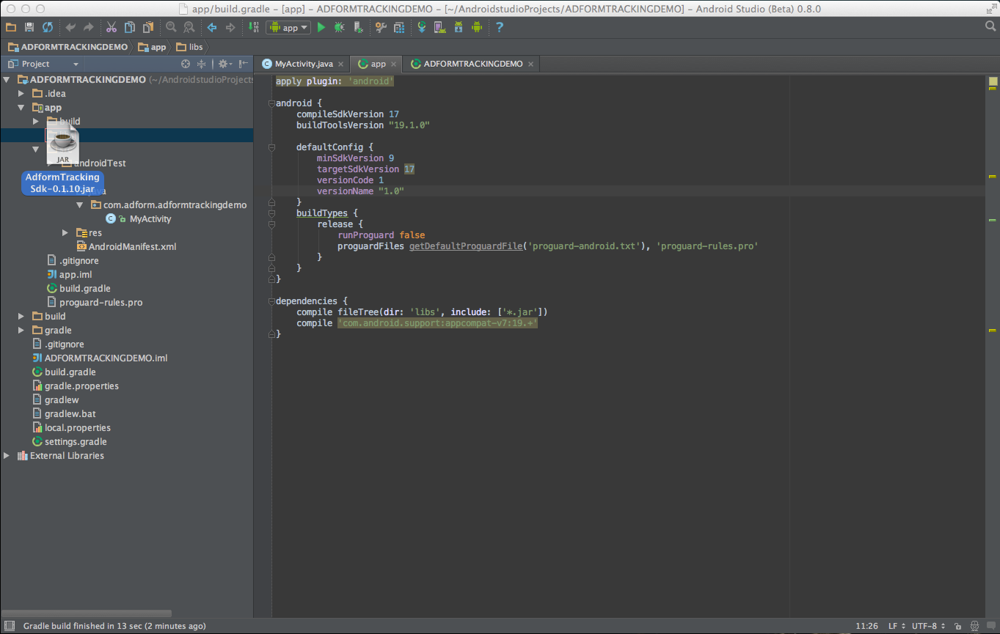
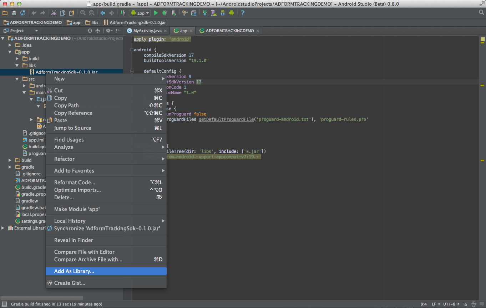
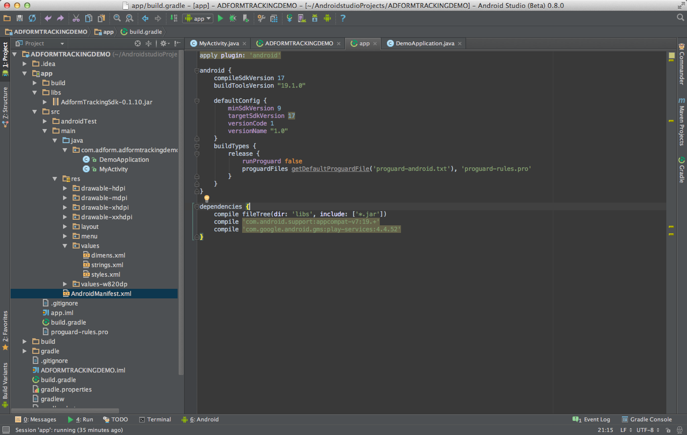
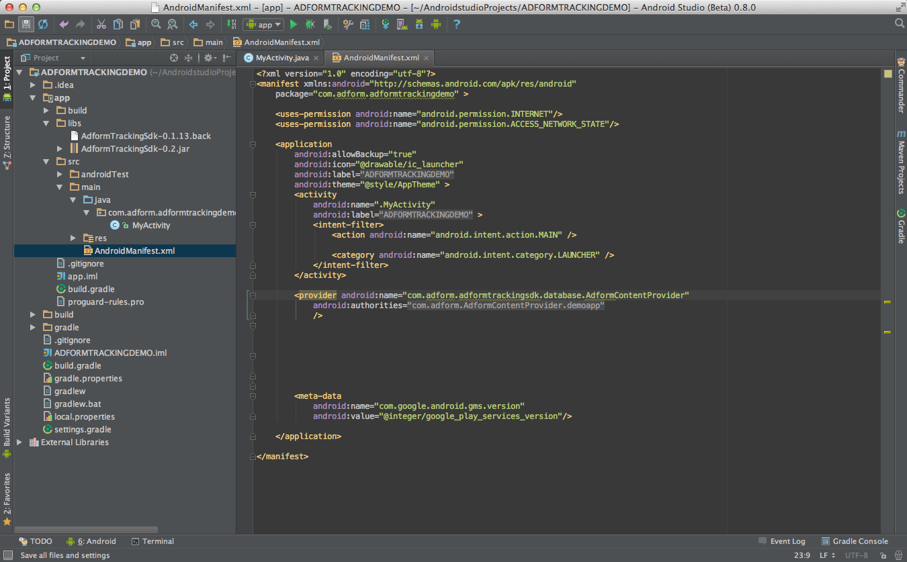
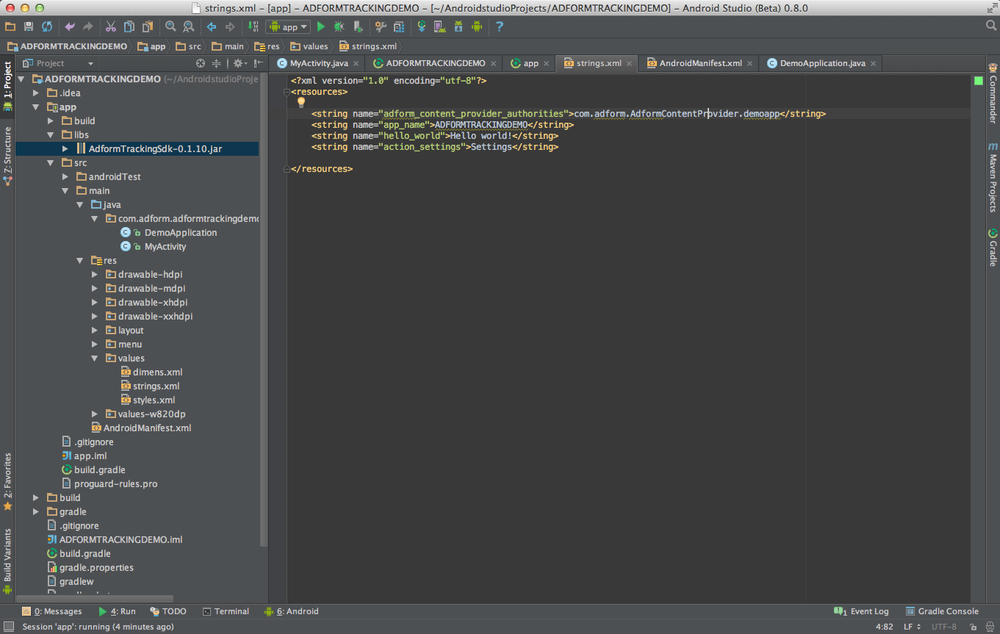

# Getting Started

When you run mobile campaigns, boost of new app installs are often one of the main goals. We are happy to announce that today we are launching app installs solution for iOS and Android devices. Easy to install SDK will enable campaign app installs tracking and reporting in Adform platform without need to deal with 3rd party SDKs and invest tons of time into that.

## 1. General Info

* Adform Tracking SDK runs on Android 2.3.* (API 10), so created project version should be 2.3.* (API 10) and above
* Also the instructions described here are done on IntelliJ 13.1. These instructions should be compatible with Android Studio also

## 2. Copy the contents of the libs folder directly the libs/ folder of your project.

* Download project library `AdformTrackingSdk-x.x.x.jar` latest version. 
* Insert library into your project.

* Right click it and hit `Add as Library...`

## 3. Set up Google Play and Adform Tracking SDK

* AdformTrackingSdk needs Google Play services. That can be done by inserting `Google Play` service dependency into `build.gradle` file.
		
	    ...
        dependencies {
            compile 'com.google.android.gms:play-services:5.0.89'
            compile fileTree(dir: 'libs', include: ['*.jar'])
        }
        ...
* How to add Google Play Services to Your Project please follow these instructions: https://developer.android.com/google/play-services/setup.html#Setup

## 4. Update AndroidManifest.xml

* Add internet reachability permissions. Update `AndroidManifest.xml` file with snippet shown below between `<manifest></manifest>` tags.

		<uses-permission android:name="android.permission.INTERNET" />
		<uses-permission android:name="android.permission.ACCESS_NETWORK_STATE" />
		    
* Also additional android services are needed to work properly. To add them, update `AndroidManifest.xml` with snipped shown below between `<application></application>` tags.

        <provider android:name="com.adform.adformtrackingsdk.database.AdformContentProvider"
            android:authorities="@string/adform_content_provider_authorities"
            />
        <receiver
            android:name="com.adform.adformtrackingsdk.services.ReferrerReceiver"
            android:exported="true">
            <intent-filter>
                <action android:name="com.android.vending.INSTALL_REFERRER" />
            </intent-filter>
        </receiver>
        <meta-data
            android:name="com.google.android.gms.version"
            android:value="@integer/google_play_services_version"/>
            
*Note that some old services were* ***deprecated*** *and AndroidManifest.xml should be updated by the new one for the sdk to work properly.*

* A unique identifier must be added in `strings.xml` file. Please note that `[appname]` should be replaced with your application name.
	
		<string name="adform_content_provider_authorities">com.adform.AdformContentProvider.[appname]</string>

		
Now you are set to use sdk. 

# Basic integration
## Start tracking
		
To start tracking, you need to 	run `startTracking` method. Note that `[tracking id]` should be replaced with your tracking id.

	AdformTrackingSdk.startTracking(getApplicationContext(), [tracking id]);
		
A good place to put it is Activity/Fragment onCreate() method. Alternatively this can also be done in Application class, as this method should be started only once and will not take any affect when running multiple times. 

Also, AdformTrackingSdk needs methods that would indicate of application activity, such as `onResume` and `onPause`. 

*Note that an old method* ***onStop was deprecated*** *and will not be used in the future, so it should be deleted if it was used before.*

    @Override
    protected void onResume() {
        super.onResume();
        AdformTrackingSdk.onResume();
    }

    @Override
    protected void onPause() {
        super.onPause();
        AdformTrackingSdk.onPause();
    }
    

    		
## Sending events    		
To create an event, first you need to create a TrackPoint with `[track id]`. Note that `startTracking` should occur before event sending.

	TrackPoint trackPoint = new TrackPoint([tracking id]);
	
Also some advanced integrations are available, like custom parameter or using custom application name setting. 

* Setting custom application name: 

		trackPoint.setAppName("custom application name");
		
* Adding custom parameters:
	
		Map<String, String> map = new HashMap();
		map.put("key", "value");
		trackPoint.setParameters(map);

* Adding section name:
	
		trackPoint.setSectionName("section name");
		
To send prepared track point, just use `sendTrackPoint`.

	AdformTrackingSdk.sendTrackPoint(trackPoint);

# Advanced integration

## Send custom events when starting track
To send custom parameters when starting track, you can add them **before** using `startTracking` method.

    Map<String, String> map = new HashMap();
    map.put("var1", "Custom Value 1");
    map.put("var2", "Custom Value 2");
    map.put("var3", "Custom Value 3");
    AdformTrackingSdk.setParameters(map);
    
This also applies when you want to send custom application name.

	AdformTrackingSdk.setAppName("Custom application name");
	
## Enable/Disable tracking
You can enable/disable tracking tracking by calling `setEnabled(boolean)` method.

	AdformTrackingSdk.setEnabled(true);

