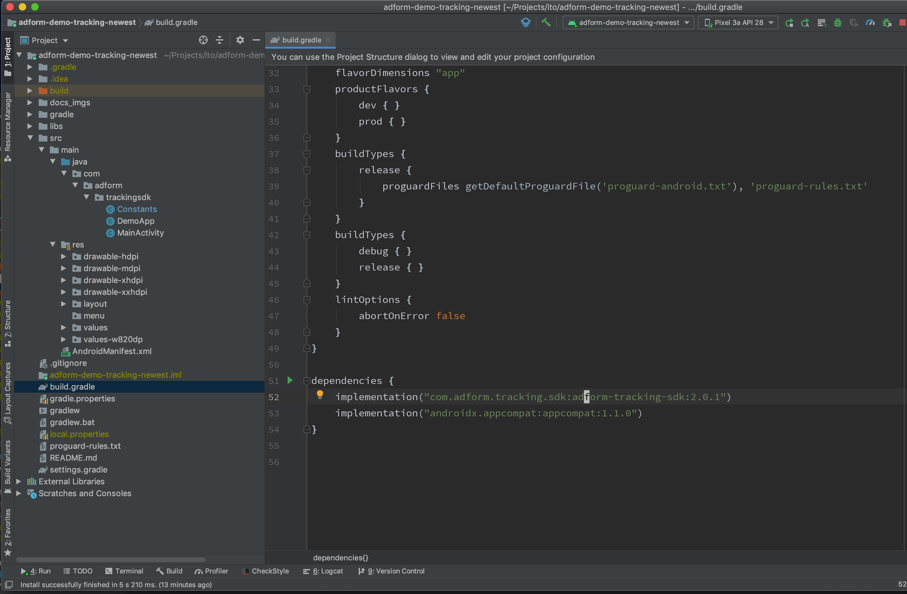
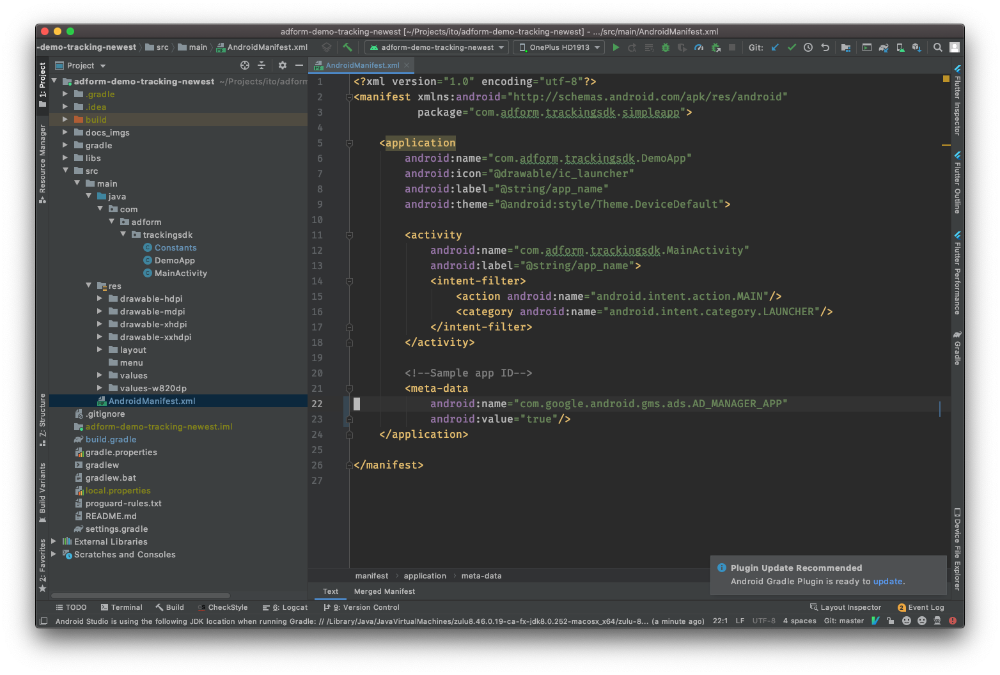

# Getting Started

When you run mobile campaigns, boost of new app installs are often one of the main goals. Our easy to install Tracking SDK will enable campaign app installs tracking and reporting in Adform platform without need to deal with 3rd party SDKs and invest tons of time into that.


## 1. General Info

-   Adform-tracking-sdk `2.x` supports AndroidX.
    -   If you&rsquo;re not using AndroidX, lowest version that uses &rsquo;Android support packages&rsquo; is `1.x`.
    -   All new features will be provided on `2.+`
-   Versions `2.x` and `1.x` are vastly different, so don&rsquo;t forget to make sure you&rsquo;re following documentation for **correct version**.
-   If you&rsquo;re upgrading from `1.x` to `2.x`, read the documentation through, as there are multiple things that are done differently
-   Minimal supported version is Android 4.1+ (API 16)


### 1.1. Plugins

Tracking SDK is also available on these platforms:

-   ***[Unity](https://github.com/adform/adform-tracking-sdk-unity-plugin)***
-   ***[Xamarin](https://github.com/adform/adform-tracking-sdk-xamarin/wiki/xamarin-android-integration-guide)***


## 2. Setting up library dependencies

-   To add a library to the dependencies, first we need to specify repository location. This can be done by editing `build.gradle` file and by inserting snippet (specified below) right above the `android` configuration group.

```java
repositories {
    maven { url "https://github.com/adform/adform-tracking-android-sdk/raw/master/releases/" }
}
```

-   Then in the dependency group we need to specify that we will be using `AdformTrackingSdk`
    -   Note: SDK uses AndroidX, so your project should use it as well, or you&rsquo;ll have to use older version.

```java
dependencies {
    implementation "com.adform.tracking.sdk:adform-tracking-sdk:2.1.0"
}
```




## 3. Update AndroidManifest.xml

-   Add Google GMS service ID .
    -   **Make sure you&rsquo;re using your own ID here**
    -   To add - update `AndroidManifest.xml` with snipped shown below between `<application></application>` tags.
    -   Find more info: [Google ad manager docs](https://developers.google.com/ad-manager/mobile-ads-sdk/android/quick-start#update_your_androidmanifestxml)

```java
<!--Sample app ID-->
<meta-data
    android:name="com.google.android.gms.ads.AD_MANAGER_APP"
    android:value="true"/>
```



Now you are set to use sdk.


# Basic integration


## Start tracking

To start tracking, you need to run `startTracking` method. Note that `Tracking_ID` should be replaced with your tracking id.

```java
AdformTrackingSdk.startTracking(this, Tracking_ID);
```

A good place to put it is Activity/Fragment onCreate() method. Alternatively this can also be done in Application class, as this method should be started only once and will not take any affect when running multiple times.

Also, AdformTrackingSdk needs methods that would indicate of application activity, such as `onResume` and `onPause`.

*Note that an old method* ***onStop was deprecated*** *and will not be used in the future, so it should be deleted if it was used before.*

```java
@Override
protected void onResume() {
    super.onResume();
    AdformTrackingSdk.onResume(this);
}

@Override
protected void onPause() {
    super.onPause();
    AdformTrackingSdk.onPause();
}
```


-   Optionally you can set custom application name and custom variables before calling `startTracking:`.

```java
AdformTrackingSdk.setAppName("Custom app name");

Order order = new Order();
order.setCurrency("currency");
order.setOrderStatus("order status");
order.setEmail("email");
order.setOrderId("order id");

// You can also set other custom variables.
order.addCustomValue(1, "var1 value"); //Set index (1-10) of custom variable and value
order.addSystemValue(5, "sv5 value"); //Set index (1-89) of system variable and value
order.addNumericValue(3, 45.4); //Set index (1 or 2) of numeric system variable and value (numeric format)

AdformTrackingSdk.setOrder(order);

AdformTrackingSdk.startTracking(this, Tracking_ID);
```


## Sending custom app events

To create an event, first you need to create a TrackPoint with `Tracking_ID`. Note that `startTracking` should occur before event sending.

```java
TrackPoint trackPoint = new TrackPoint(Tracking_ID);
```

Also some advanced integrations are available, like custom variables or using custom application name setting.

-   Setting custom application name:

```java
trackPoint.setAppName("custom application name");
```

-   In order to send custom variables you need to create `Order` object and set your order values. When defining variables it&rsquo;s required to keep in mind, that there are different type of variables:
    -   Custom variables with predefined names (orderid, currency, firstname, etc.)
    -   Custom variables (var1-var10)
    -   System variables (sv1-sv89)
    -   Numeric system variables (svn1, svn2)

```java
Order order = new Order();
order.setCurrency("currency");
order.setOrderStatus("order status");
order.setEmail("email");
order.setFirstName("name");
order.setLastName("last name");
order.setAddress1("address 1");
order.setAddress2("address 2");
order.setPhone("phone");
order.setBasketSize(7); //numeric format
order.setZip("zip");
order.setCountry("country");
order.setAgeGroup("age group");
order.setGender("gender");
order.setOrderId("order id");
order.setSale(44.54); //numeric format

// You can also set other custom variables.
order.addCustomValue(1, "var1 value"); //Set index (1-10) of custom variable and value
order.addSystemValue(5, "sv5 value"); //Set index (1-89) of system variable and value
order.addNumericValue(3, 45.4); //Set index (1 or 2) of numeric system variable and value (numeric format)

//Set created order for the trackpoint
trackPoint.setOrder(order);
```

-   Setting custom tracking point name:

```java
trackPoint.setSectionName("Tracking point name");
```

To send prepared track point, just use `sendTrackPoint`.

```java
AdformTrackingSdk.sendTrackPoint(trackPoint);
```


Also it is posible to send additional product variables information with tracking points. To do so you need to create &rsquo;ProductItem&rsquo; object and set your product values. Then add that object to the trackpoint.

```java
ProductItem productItem = new ProductItem();
productItem.setProductId("Product ID");
productItem.setProductName("Product name");
productItem.setCategoryId("Category ID");
productItem.setCategoryName("Category name");
productItem.setProductCount("Product count");
productItem.setProductSales("Product sales");
productItem.setWeight("Weight");
productItem.setStep("Step");
productItem.setCustom("Custom information");

TrackPoint trackPoint = new TrackPoint(Tracking_ID);
trackPoint.addProductItem(productItem);
```

To send multiple product variables with same tracking point, you can use such code:

```java
ProductItem productItem1 = new ProductItem();
productItem1.setProductId("Product ID");
productItem1.setProductName("Product name");
productItem1.setCategoryId("Category ID");
productItem1.setCategoryName("Category name");
productItem1.setProductCount(1);
productItem1.setProductSales(1D);
productItem1.setWeight(1);
productItem1.setStep(Byte.MIN_VALUE);
productItem1.setCustom("Custom information");

ProductItem productItem2 = new ProductItem();
productItem2.setProductId("Product ID");
productItem2.setProductName("Product name");
productItem2.setCategoryId("Category ID");
productItem2.setCategoryName("Category name");
productItem2.setProductCount(1);
productItem2.setProductSales(1D);
productItem2.setWeight(1);
productItem2.setStep(Byte.MIN_VALUE);
productItem2.setCustom("Custom information");

TrackPoint trackPoint = new TrackPoint(Tracking_ID);
trackPoint.addProductItem(productItem1);
trackPoint.addProductItem(productItem2);
```


# Custom Adform Tracking SDK implementations


## Enable/Disable tracking

You can enable/disable tracking by calling `setEnabled(boolean)` method.

```java
AdformTrackingSdk.setEnabled(true);
```


## Enable/Disable HTTPS

You can enable/disable HTTPS protocol by calling `setHttpsEnabled(boolean)` method. By default HTTPS is enabled.

```java
AdformTrackingSdk.setHttpsEnabled(true);
```


## Enable/Disable SIM card state tracking

You can enable/disable tracking by calling `setSendSimCardStateEnabled(boolean)` method. By default SIM card state tracking is disabled.

```java
AdformTrackingSdk.setSendSimCardStateEnabled(true);
```


## Enable/Disable Facebook attribution id tracking

You can enable/disable tracking by calling `setFacebookAttributionIdTrackingEnabled(boolean)` method. By default facebook attribution id tracking is enabled.

```java
AdformTrackingSdk.setFacebookAttributionIdTrackingEnabled(false);
```


## GDPR

By default Adform Tracking SDK will check CMP settings and use that information. More information about this [here](https://github.com/InteractiveAdvertisingBureau/GDPR-Transparency-and-Consent-Framework/blob/master/Mobile%20In-App%20Consent%20APIs%20v1.0%20Final.md)

It is possible to set GDPR and GDPR consent manually. You need to use `setGdpr(boolean)` and `setGdprConsent(consent)` methods. For Gdpr consent you need to set base64-encoded string.

```java
AdformTrackingSdk.setGdpr(true);
AdformTrackingSdk.setGdprConsent(Base64.encodeToString("GgdprConsent".getBytes(), Base64.NO_WRAP));
```

## Set US privacy

You can use this method to manually set the US Privacy value.

```java
AdformTrackingSdk.setUSPrivacy("1---");
```


## Set user agent

You can change webview user agent string. Webview is used to send tracking data.

```java
AdformTrackingSdk.setUserAgent("Custom User Agent");
```


## Send information to multiple clients

It is possible to send tracking information to multiple clients by defining each client Tracking id.

In order to start tracking, please use an example below:

```java
AdformTrackingSdk.startTracking(this, Tracking_ID1, Tracking_ID2, Tracking_ID3, ...);
```

To send custom tracking points for multiple clients, use the following example:

```java
MultipleTrackPointsBuilder multipleTrackPointsBuilder = new MultipleTrackPointsBuilder();

multipleTrackPointsBuilder
    .setAppName("App name")
    .setSectionName("Section name");
    .setOrder(yourOrder);

TrackPoint[] trackPoints = multipleTrackPointsBuilder.generateTrackPoints(Tracking_ID1, Tracking_ID2, Tracking_ID3, ...);

AdformTrackingSdk.sendTrackPoints(trackPoints);
```


# Migration guide


## Upgrading to 1.1

In SDK version 1.1 was added functionality, which requires additional changes during update from older versions:

-   Method `setParameters()` of `TrackPoint` class has been deprecated. Instead please use `setOrder()` method to set custom variables to tracking points.
-   Add Protobuf library. You could find how to do that [here](https://github.com/adform/adform-tracking-android-sdk#2-setting-up-library-dependencies)


# Publishing events using Adobe experience SDK

Track marketing events for Adform platform using Adobe experience SDK

-   Steps how to integrate Adform-Adobe extension can be found [here](https://github.com/adform/adform-tracking-android-sdk/blob/master/README-Adobe.md)
